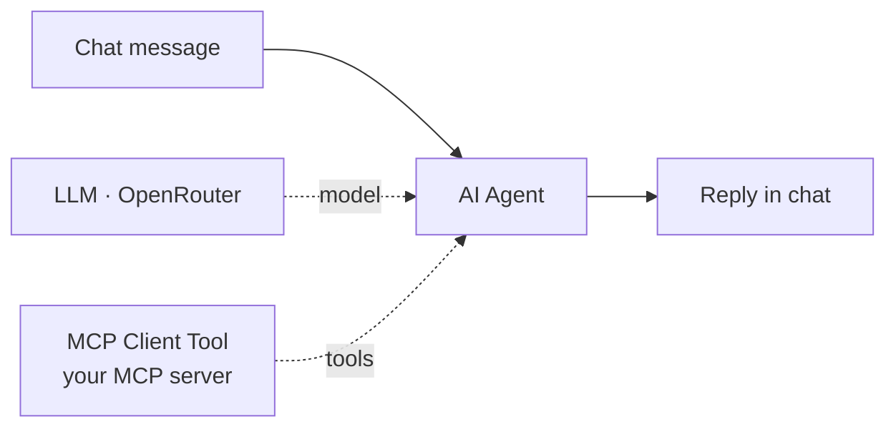
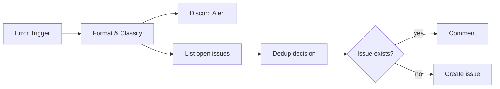
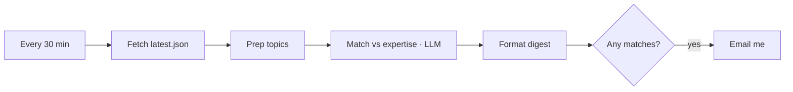
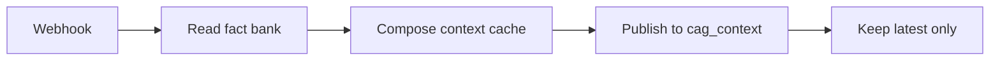
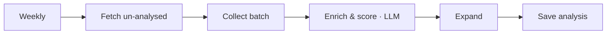
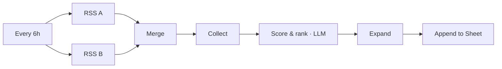
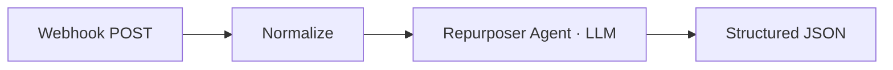

# n8n Community Templates

A set of production-minded n8n workflow templates focused on the hard-but-useful end of automation: AI agents, RAG/CAG, MCP, and production reliability. Each is generic, credential-free, and annotated with sticky notes so it's ready to import and configure.

Import any JSON from [`./workflows`](./workflows) into n8n (Workflows → Import from File), then add your own credentials.

| # | Template | What it does | Key nodes |
|---|---|---|---|
| 1 | AI Agent with MCP Client | Chat-driven agent that calls tools from any external MCP server | Chat Trigger, AI Agent, MCP Client Tool |
| 2 | Production Error Handler | Classifies failures, alerts Discord, opens deduplicated GitHub issues | Error Trigger, Code, HTTP Request |
| 3 | Forum Question Monitor | Scores a community forum's latest questions vs your expertise, emails matches | Schedule, HTTP, AI Agent, Gmail |
| 4 | CAG Knowledge Base | Builds a cache-augmented-generation context block from a Postgres fact bank | Webhook, Postgres, Code |
| 5 | Content Intelligence Enrichment | LLM themes + demand/gap scores a content backlog in Postgres | Schedule, Postgres, AI Agent |
| 6 | AI Trend Curation | Ranks RSS trends with an LLM and logs them to Google Sheets | Schedule, RSS, Merge, AI Agent, Sheets |
| 7 | AI Content Repurposer | Turns long-form content into a thread, a LinkedIn post and a newsletter blurb | Webhook, AI Agent |

---

## 1. AI Agent with MCP Client — call any MCP server
**Use case.** Let an n8n AI agent use tools exposed by any external MCP (Model Context Protocol) server — a docs server, a database server, another team's endpoint.
**Flow.** Chat message → AI Agent inspects the connected MCP server's tools → calls the right tool(s) → replies in chat.
**Nodes.** `chatTrigger` → `agent` (promptType `auto`) with sub-nodes `lmChatOpenRouter` (model) + `mcpClientTool` (endpointUrl, transport `httpStreamable`, expose `all`). Credential: OpenRouter.

**JSON.** [`workflows/07-mcp-client-agent.json`](./workflows/07-mcp-client-agent.json)
**Setup.** 1) Add OpenRouter credential. 2) In *MCP Server Tools* set your MCP `endpointUrl` (+ transport/auth if needed). 3) Chat and ask something the server's tools can answer.

## 2. Production Error Handler — classify, alert, deduped GitHub issues
**Use case.** One central workflow to catch every production failure — set it as the *Error Workflow* on your other workflows.
**Flow.** A workflow fails → classify the error by remediation owner (auth→human, rate-limit→agent, transient→auto-retry…) → post a Discord alert → open **one** GitHub issue per failing workflow, commenting on recurrence instead of duplicating.
**Nodes.** `errorTrigger` → `Code` (format + classify) → parallel: Discord webhook `httpRequest`; GitHub list-issues → `Code` dedup → `if` → comment **or** create issue. Credentials: GitHub token (Bearer); Discord webhook URL.

**JSON.** [`workflows/04-production-error-handler.json`](./workflows/04-production-error-handler.json)
**Setup.** 1) Set GitHub `OWNER`/`REPO` in *Format & Classify*. 2) Replace the Discord webhook URL. 3) Add a GitHub token credential. 4) On each workflow to monitor: Settings → Error Workflow → select this.

## 3. Forum Question Monitor — find questions to answer with AI
**Use case.** Surface the community-forum questions worth your time.
**Flow.** Every 30 min → pull a Discourse forum's `latest.json` → an LLM scores each topic vs your expertise → email only the matches, with a reason and talking points.
**Nodes.** `scheduleTrigger` → `httpRequest` → `Code` → `agent` (OpenRouter + structured parser) → `Code` → `if` → `gmail`. Credentials: OpenRouter, Gmail.

**JSON.** [`workflows/05-forum-question-monitor.json`](./workflows/05-forum-question-monitor.json)
**Setup.** 1) Add OpenRouter + Gmail credentials. 2) Set your email in *Email Me Matches*. 3) Edit expertise areas in the agent prompt. Works on any Discourse forum's `latest.json`.

## 4. CAG Knowledge Base — context-cache builder
**Use case.** Cache-Augmented Generation: a simpler, cheaper alternative to a vector DB when your knowledge fits one curated context block.
**Flow.** Trigger a rebuild → read a Postgres fact bank → compose one structured *business brief* → store the latest in `cag_context` → your AI agent reads that single block.
**Nodes.** `webhook` → `postgres` read → `Code` compose → `postgres` insert → `postgres` trim. Credential: Postgres.

**JSON.** [`workflows/02-cag-knowledge-base.json`](./workflows/02-cag-knowledge-base.json)
**Setup.** 1) Add a Postgres credential. 2) Create `intake_answer`, `tenant`, `cag_context` tables. 3) POST to `/webhook/context-build` to (re)build.

## 5. Content Intelligence Enrichment — score & tag a backlog
**Use case.** Auto-theme and prioritise a backlog of content items with demand × gap scoring.
**Flow.** Weekly → read un-analysed rows from Postgres → an LLM assigns theme + demand + gap + summary → upsert into an analysis table.
**Nodes.** `scheduleTrigger` → `postgres` select → `aggregate` → `agent` → `Code` → `postgres` insert. Credentials: Postgres, OpenRouter.

**JSON.** [`workflows/03-content-intelligence-enrichment.json`](./workflows/03-content-intelligence-enrichment.json)
**Setup.** 1) Add Postgres + OpenRouter credentials. 2) Create `content_items` and `item_analysis` tables. 3) Edit the rubric in *Enrich & Score*.

## 6. AI Trend Curation — RSS → LLM scoring → Google Sheets
**Use case.** A ranked, de-noised feed of what matters in your space each day.
**Flow.** Every 6h → read RSS feeds → merge/aggregate → an LLM ranks the most relevant items with a content angle → append to a Google Sheet.
**Nodes.** `scheduleTrigger` → 2× `rssFeedRead` → `merge` → `aggregate` → `agent` → `Code` → `googleSheets`. Credentials: OpenRouter, Google Sheets.

**JSON.** [`workflows/06-ai-trend-curation.json`](./workflows/06-ai-trend-curation.json)
**Setup.** 1) Add OpenRouter + Google Sheets credentials. 2) Select the destination spreadsheet/sheet. 3) Add/replace RSS feed URLs.

## 7. AI Content Repurposer — long-form → social + newsletter
**Use case.** Turn one long-form piece into a Twitter/X thread, a LinkedIn post and a newsletter blurb.
**Flow.** POST content to a webhook → normalise → an AI agent returns three platform-ready formats as structured JSON.
**Nodes.** `webhook` → `set` → `agent` (OpenRouter + structured parser). Credential: OpenRouter.

**JSON.** [`workflows/01-ai-content-repurposer.json`](./workflows/01-ai-content-repurposer.json)
**Setup.** 1) Add OpenRouter credential. 2) Activate; copy the webhook URL. 3) POST `{content, title, target_audience}` to `/webhook/repurpose-content`.

---

*All templates are generic and credential-free; add your own credentials after importing. Model nodes use OpenRouter by default and can be swapped for any chat model.*
